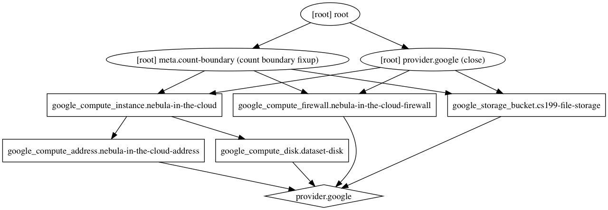

# MP 7: Introduction to Terraform

## Introduction

This MP will introduce Terraform. You will be writing a Terraform configuration file that will deploy resources in [Google Cloud Platform](http://cloud.google.com/) (GCP).

### Background

[Terraform](https://www.terraform.io/) is one of the Infrastructure-as-Code frameworks that we talked about in lecture. It has become quite popular in recent years because it's relatively easy to configure, and is platform agnostic. Terraform supports AWS, GCP, and Azure, among other cloud platforms.

The main idea behind Terraform is that infrastructure should be:

* Totally reproducable
* Able to be applied consistently and automatically
* Able to be version controlled
* Able to be collaborated on

Terraform does this by saving your infrastructure configuration in `*.tf` files, and saving the current state of your deployed infrastructure in a `*.tfstate` file. We won't be talking much about `*.tfstate` files in the MP, but know that they are very important to include in your source control so that state can be maintained between users of Terraform.

Internally, Terraform has the concept of resource dependency. As we'll see later in this MP, Terraform calculates an internal dependency graph for all cloud resources. This is very useful because cloud infrastructure often needs to be created in a specific order. For example, you may need to create virtual disks *before* you can create your VM instances and attach those disks to those instances.

Additionally, Terraform is smart about "applying" infrastructure changes. If you change a property (i.e. the name) of a resource, Terraform is usually able to simply edit that resource instead of deleting the old resource and recreating it. However, this is not perfect, and sometimes limitations in the API of your cloud provider will necessitate deleting and recreating resources.

### Example

The basic terraform structure for a resource is as follows:

```
resource "<RESOURCE_TYPE>" "<RESOURCE_IDENTIFIER" {
    ...
    <RESOURCE SETTINGS>
    ...
}
```

The following is an example of what a simple GCP SQL database setup could look like.

```
resource "google_sql_database_instance" "master" {
  // The name of the database on GCP
  name = "master-instance"

  settings {
    tier = "D0"
  }
}

resource "google_sql_database" "test-database" {
  name      = "test-db"

  // Notice that we can access attributes of other resources
  instance  = "${google_sql_database_instance.master.name}"

  charset   = "latin1"
  collation = "latin1_swedish_ci"
}

resource "google_sql_user" "test-database-student-user" {
  name     = "cs199student"
  instance = "${google_sql_database_instance.master.name}"
  host     = "0.0.0.0"
  password = "changeme"
}
```

An important thing to node is the interpolation syntax. For example, when creating the SQL user, we need to reference the SQL database that the user should be connected to. We could manually populate this instance name, because we are in control of the databases name, however it is much better to use interpolation. Note that `${google_sql_database_instance.master.name}` will be interpolated to `master-instance` (the name of the database) at runtime. This is useful because if later on we decide to change the name of the database, we only have to change this in one place, and not look for references to that specific name all over our codebase.

For more examples of Terraform syntax, check the documentation linked to in the Resources section.


### Resources

You will have a much easier time with this MP if you heavily consult the Terraform documentation for GCP. You can find that documentation [here](https://www.terraform.io/docs/providers/google/index.html).

Additionally, Terraform has some example GCP compatible examples that you can refer to [here](https://github.com/terraform-providers/terraform-provider-google/tree/master/examples). (Be warned though that these examples are a bit more complicated than the work we're asking you to do)

### Setup

Download and install the version of Terraform for your system from [this page](https://www.terraform.io/downloads.html).

## MP Activities

### Problem Statement

In this MP, we'll be setting up a very basic cloud application configuration. We'll be addressing how to setup a VM instance, different options for persistent storage, and some basic networking.

Terraform can display what our infrastructure looks like once it's setup. Here's the graph of what we'll setup in the subsequent problems:



(*Hint:* Once you've completed the MP, you can run `terraform graph | dot -Tpng > graph.png` if you have [graphviz](http://www.graphviz.org/) installed to double check that your solution matches this graph!)


### Problem 1 - Getting Everything Setup
First, we need to get a GCP project and credentials setup, so that we have a place to work on deploying our cloud infrastructure. Here's what you need to do:

1. Create a project in GCP titled something like "cs199-YOUR_NETID-mp7". You will need to change the "project" field in `main.tf` to reflect your project name.
2. Create and download an "Authenticated JSON File" from GCP using [this tutorial](https://www.terraform.io/docs/providers/google/index.html#authentication-json-file). This is how Terraform will authenticate with GCP when it goes to deploy your infrastructure. **Important:** Place the contents of this file in a file called `account.json` in this MP folder.
    * **Note:** You may have to create a "Service Account". The name of this service account can be arbitrary, but make sure to give it the "Project Owner" Role so that it has permissions to manipulate your cloud infrastructure.
3. Enable the following APIs in the GCP console. Do this by going to the "API and Services" menu item in the GCP console, navigating to the "Dashboard" of this view, and clicking "Enable API and Services". Then, enable the following APIs:
    * Google Compute Engine API
    * Cloud Storage JSON API
4. Run `terraform init` in the MP directory. This will download the GCP Terraform plugin, and get everything setup.
5. Run `terraform get` in the MP directory. This will load and validate the essentially empty `main.tf` Terraform file.
6. Run `terraform plan` and then `terraform apply`. Terraform should report that there are no changes needed. This is a good thing! We're just getting started.

**Note**: After each step, it is helpful to run the `terraform get`/`terraform plan`/`terraform apply` sequence. This will confirm for you that your terraform code is valid, and is able to be applied.


### Problem 2 - Creating a Storage Bucket
As we discussed in lecture, "Storage Buckets" are a useful way to store static resources. Often times, user data (like images) will be stored in storage buckets. These buckets are also sometimes used for large datasets, as they tend to scale elastically. You don't have to have a maximum size on your storage buckets, like you need to do with virtual disks. These Storage Buckets are usually backed by a service, so that people can access data inside these buckets from the wider Internet (if that's how you set them up). In GCP this service is called "Google Storage"; in AWS, this is called "S3" (Simple Storage Service). This problem will have you setup a storage bucket.

1. Create a `google_storage_bucket` resource that is named `cs199-file-storage`.
2. Make sure that the storage bucket located in the `US`.
3. Enable `versioning` for this bucket.

### Problem 3 - Creating an Instance
Instances are the core of many cloud computing infrastructures. An "instance" is essentially just a managed VM. You can specify the requested specifications of your VM (memory, number of VPCUs, etc) at the creation time of your VM. Furthermore, GCP and other cloud platforms have a variety of ready-made "images" to initialize your VM. These images contain copies of a specific operating system. We'll be using Ubuntu for this example, but there are also public images of other Linux distributions (Debian, CentOS, etc.) and Windows.

1. Create a `google_compute_instance` resource named `nebula-in-the-cloud`
2. Set the machine type of this instance to `n1-standard-1`
3. Add the following tags to the instance: `cs199`, `mp7`
4. Add a boot disk to your image, and make sure that it initializes to the `ubuntu-os-cloud/ubuntu-1604-lts` image
5. Make sure that your image is in the `us-central1-a` zone. (This is a reference to the physical location of your VM)
6. Set the description of your instance to be `Look, we're cooking with clouds now!`
7. Set the `metadata_startup_script` on you instance to be `"${file("startup.sh")}"`. This loads the simple script we've provided you, and runs it when your instance starts up.

(*Note:* Your network interfaces can be empty to begin with)

### Problem 4 - Creating a Disk and Attaching It
Virtual disks are another way of managing persistent storage. These are most analogous to traditional hard drives (or SSDs). They don't usually have a service behind them, so data on these disks cannot be directly accessed from outside the VM it's attached to. You also have to provide a maximum capacity for drives. In recent years, you have also been able to choose the storage medium of these drives. Usually, you have a choice between spinning disks (hard drives) and solid state media. Solid state media tends to be faster, but will cost extra.

1. Create a `google_compute_disk` resource named `dataset-disk`
2. Set the disk's size to be `10` Gigabytes
3. Set the zone of the disk to be `us-central1-a`
4. Attach this disk to the instance you created in Problem 3 by modifying the configuration for your `nebula_in_the_cloud` instance (*Note:* You will need to read up on resource "self_link"s and variable interpolation to do this problem correctly)

### Problem 5 - Making Your Instance Accessible
Now that we have an instance setup, we ant to make it accessible to the wider Internet. By default, your VM will only be accessible from within your private project within GCP. It will only be assigned a private "internal" IP address (like the `192.168.*.*` address that your computer probably has internally). First we will allocate an external IP address from GCP. This will give us the exclusive right to use that IP address for whatever purpose we want. Then, we will attach this IP address to our instance so that traffic that is routed to our external IP will be routed to our instance. This will involve editing the configuration of our instance. Finally, we will create a firewall rule to allow ingress traffic on port `8000` to be accepted by our instance. By default, the networking settings on instances will be very strict so that no one can access your VM without your permission.

1. Create a `google_compute_address` named `nebula-in-the-cloud-address`
2. Attach this address to your `nebula_in_the_cloud` instance by adding it as a `nat_ip` to the instances `network_interface`. (*Note:* You will need to read up on resource "self_link"s and variable interpolation to do this problem correctly)
3. Create a `google_compute_firewall` named `nebula-in-the-cloud-firewall`. Set the network to `default`, and allow the `tcp` protocol on port `8000`.

Go into the GCP console, and then check under "VPC Network" > "External IP Addresses". Find the IP address for `nebula-in-the-cloud-address`. If you run `ping <THE_ADDRESS>` in your terminal, you should be able to ping your instance from the "outside world". Cool!

Now, go to `<THE_ADDRESS>:8000` in your browser. You should see a friendly "hello world" page if all of your networking is setup correctly. Nice job! (*Note:* It may take a couple minutes for your instance to boot up. Don't worry if it takes a couple minutes)

### Problem N - Tear it all down!

🚨 **This is an important step!** 🚨

Run `terraform destroy`, and then type in `yes`.

**Note:** This will delete all of your infrastructure in GCP. We're just experimenting with GCP, so we don't want to waste our credits on resources that we aren't using! `terraform destroy` is analogous to `rm -rf /`, so be very careful about it's use in non-experimental situations!

## Deliverables
By the end of the MP, you should have **one** Terraform file (`main.tf`) that solves all the activity problems. We will check off if you have all **17** of the requirements listed above for one point each, totaling 17 points for this MP. Please, if you are having any troubles setting up, let us know during office hours or through Piazza.

Submit your Terraform file as MP7 on Moodle. That's it! (**Note**: You won't lose any points if you do this, but you probably don't want to submit your `account.json` as part of your submission)
